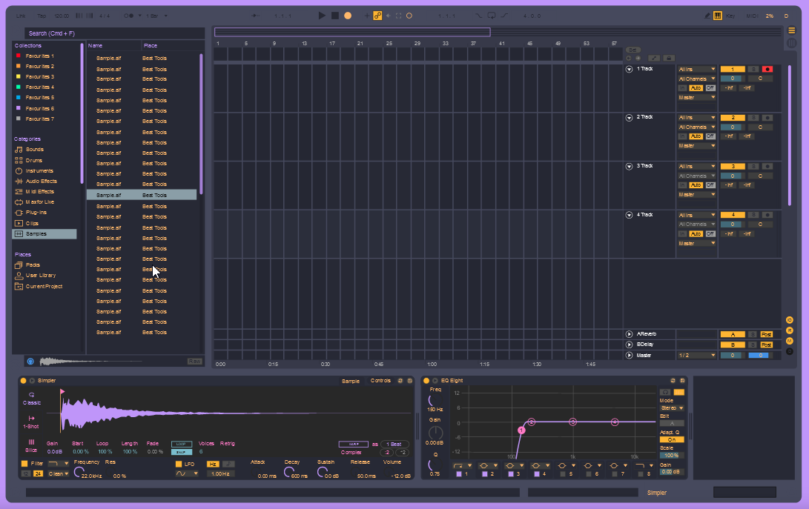

# Dracula for [Ableton10](https://www.ableton.com)

> A dark theme for Ableton10](https://www.ableton.com)

## Install

All instructions can be found at [draculatheme.com/x](https://draculatheme.com/AbletonTheme).

 put .ask file in .C:\ProgramData\Ableton\Live 10 Suite\Resources\Themes

## Team

This theme is maintained by the following person(s) and a bunch of [awesome contributors](https://github.com/dracula/template/graphs/contributors).

 | 
--- | ---
[Harrison Heck](https://github.com/nesl247) | [Zeno Rocha](https://github.com/zenorocha)

## License

[MIT License](./LICENSE)
